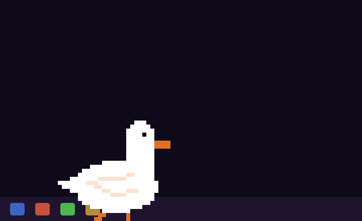

# Duck Pet Claude

A pixel art desktop duck that walks around your screen with a built-in Claude Code terminal.



Click the duck to wave. Right-click for the menu. Open **Chat** to get a full Claude Code terminal floating above the duck's head.

## Features

- **Built-in Claude Code terminal** — right-click the duck, hit Chat, and a full PTY terminal opens above its head. Everything you can do in Claude Code works here.
- **Idle personality** — the duck talks on its own. Time-of-day greetings, random quips, and reactions when Claude starts or finishes working. Toggle on/off from the right-click menu.
- **Custom sprites** — swap the duck for any pixel art character. Drop a sprite pack folder and switch from the right-click menu, no restart needed.
- **Claude awareness** — the duck watches for running Claude Code processes. Gets excited when Claude is working, celebrates when it finishes.
- **Voice chat** (optional) — talk to the duck with your microphone using Edge TTS + Whisper.
- **Obsidian brain** — the duck searches your Obsidian vault and claude-mem history to answer questions with context.

## Requirements

- **Windows 10/11**
- **Python 3.10+** — [python.org](https://python.org) (check "Add Python to PATH" during install)
- **Claude Code** — [claude.ai/download](https://claude.ai/download) (free CLI from Anthropic)

## Quick Start

### Option 1: Double-click
Run `start.bat` — the duck appears on your taskbar in a few seconds.

### Option 2: Terminal
```
python setup.py
python pet.py
```

## Setup

1. **Install dependencies:**
   ```
   pip install -r requirements.txt
   ```

2. **Generate sprites** (only needed once):
   ```
   python sprite_gen.py source.gif
   ```
   Sprites are pre-generated in the `sprites/` folder, so you can skip this step unless you want to use your own GIF.

3. **Launch the duck:**
   ```
   python pet.py
   ```
   Or double-click `start.bat`.

## Controls

| Action | What happens |
|--------|-------------|
| **Click** | Duck waves |
| **Drag** | Move the duck |
| **Right-click** | Menu — Chat, Sit, Wave, Celebrate, Sprites, Personality |
| **Chat** | Opens a Claude Code terminal above the duck |
| **Mouse wheel** (in terminal) | Scroll history |

## Configuration

Edit `config.json` to customize behavior:

```json
{
  "sprite_pack": "default",
  "pet_name": "Duck",
  "personality": {
    "enabled": true,
    "quip_interval_min": 45,
    "quip_interval_max": 120,
    "greeting_on_start": true
  }
}
```

- **`sprite_pack`** — `"default"` for the original duck, a name like `"cat"` to load from `sprite_packs/cat/`, or an absolute path to a sprite folder.
- **`pet_name`** — display name (used in logs).
- **`personality.enabled`** — toggle idle quips (also available in right-click menu).
- **`personality.quip_interval_min/max`** — seconds between random quips.

## Custom Sprite Packs

Create a folder in `sprite_packs/` with GIF animations for each state:

```
sprite_packs/
  cat/
    idle.gif        (required)
    walk_left.gif
    walk_right.gif
    sit.gif
    active.gif
    wave.gif
    talk.gif
    celebrate.gif
    listen.gif
```

Only `idle.gif` is required — missing animations fall back gracefully. Use `sprite_gen.py` to generate a full set from any animated GIF:

```
python sprite_gen.py my_character.gif --output sprite_packs/my_character
```

Switch packs from the right-click menu or set `"sprite_pack"` in `config.json`.

## Voice Chat (Optional)

Talk to the duck with your microphone. Requires extra dependencies:

```
pip install -r voice_requirements.txt
python voice.py
```

Uses Edge TTS for speech and Whisper for listening. Say "bye" or "stop" to end.

## How It Works

- The duck watches for running Claude Code processes and reacts (gets excited when Claude is working, celebrates when it finishes)
- The terminal is a real PTY — everything you can do in Claude Code works here
- The personality engine fires time-aware greetings and random quips on a configurable interval
- Sprites are generated from `source.gif` using `sprite_gen.py`

## Troubleshooting

- **"Python not found"** — Make sure Python is in your PATH. Reinstall with "Add to PATH" checked.
- **"Claude Code not found"** — Install from [claude.ai/download](https://claude.ai/download), then restart your terminal.
- **Duck won't start** — Delete `.pet.lock` if it exists, then try again.
- **Terminal blank** — Click inside the terminal window to focus it. Type something.
- **Sprites not showing** — Make sure your sprite pack has at least `idle.gif`. Check the path in `config.json`.

## Pre-built Version

Don't want to set up Python? A ready-to-run zip is available on Gumroad — search "Duck Pet Claude" by Mffn.

## License

Free for personal use. Do whatever you want with it.
